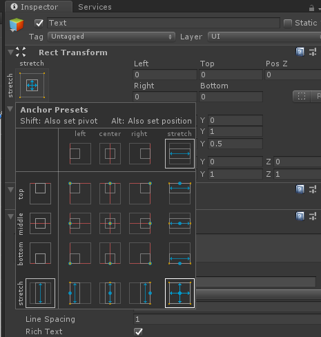

# Workshop med IFI Spillutvikling - Hyper-Casual

## Intro
Hyper-Casual-spill går ofte ut på enkle mechanics og gameplay, og har som regel et enkelt design. Dette gjør at de ofte egner seg godt som mobilspill. I denne workshoppen skal vi utvikle et enkelt spill som minner om Flappy Bird, og så skal vi se på hvordan vi kan bygge dette spillet til mobil.

Oppgavene er ganske åpne, og formålet er å bli bedre kjent med mer av programmeringen i Unity med C#. For hver oppgave vil det ligge både hint (:bulb:) og et løsningsforslag (:floppy_disk:).

Spillet går ut på å komme seg gjennom hindre ved å endre hvilken retning spilleren faller.

## Del 1 - Gjør klart prosjektet
Opprett et nytt Unity-prosjekt. Prosjektet skal bruke under Template velger du **2D**. Last ned dette repoet som zip ([last ned repoet som .zip her](https://github.com/sivertschou/ifispillutvikling-workshop-hyper-casual/archive/master.zip)). Erstatt Assets-mappen i prosjektet ditt med Assets-mappen i dette repoet.

Når det kommer til **Sprites**, så er vi så heldige at vi har fått laget sprites tilpasset akkurat denne workshoppen. Disse ligger i Sprites/Ekstrasprites-mappen, og de er det bare å bruke! Dersom du ønsker å starte med enkle bokser er det også bare å gjøre det - det er veldig enkelt å bytte til bedre sprites senere:)

## Del 2 - Legg til player
Unity har mange innebydge hjelpemidler, og et godt eksempel på dette er InputManager. Med dette verktøyet kan du enkelt håndere brukerinput. Vi skal ta en titt på hvordan dette er lagt opp, slik at vi enkel kan endre dette, om nødvendig.

### Oppgave 1.1
Klikk på Edit -> Project Settings -> Inputs. Vi ser nå at Inspector-en vår viser Input Manager. Klikk på Axes for å vise alt vi kan endre. Trykk på Jump for å se hva denne er mappet til. Vi ser at denne er mappet til space, og det er bra. Vi kunne også ha mappet denne til andre verdier, og eventuelt lagt til flere Inputs. Mer informasjon om dette kan du finne [her](https://docs.unity3d.com/Manual/ConventionalGameInput.html). En fordel med å bruke dette er at brukeren enkelt kan mappe f.eks. Jump til hva enn den vil før spillet starter.

### Oppgave 1.2
Nå som vi har inputen på plass, er det på tide å legge til en spiller. Vi oppretter et tomt GameObject ved å høyreklikke i Hiererchy-vinduet etterfulgt av Create Empty. Gi dette objektet navnet "Player" og gi den Tag-en "Player". Dobbelsjekk at det nye objektet har (0,0,0) som posisjon og rotasjon og (1,1,1) som scale i Transform-komponenten. Dersom dette ikke skulle være tilfellet kan du klikke på det lille tannhjulet i komponentn etterfulgt av Reset. Vi ønsker å legge til et par komponeneter; Sprite Renderer, Box Collider 2D og RigidBody 2D. 

<p>
    <br>
</p>

### Oppgave 1.3
Vi har nå opprettet et Player-objektet og lagt til de viktigste komponentene, kan vi endre på verdiene slik at de passer bra til spillet vårt. Vi starter med å endre **Sprite-feltet** i **Sprite Renderer-komponenten**. Trykk på den lille sirkelen til høyre for feltet og velg deretter PlayerBox. Vi ser nå at spilleren vår er en hvit boks, og dette gjør at vi enkelt kan endre fargen på spilleren ved å endre på Color-feltet.

Vi ønsker nå å stille inn Box Collideren slik at den er klar til å brukes senere. Vi må endre **size**-verdien til noe som matcher grafikken. Her fungerer det fint med `size = (1, 1)`.

Vi kan nå teste at alt fungerer som det skal ved å trykke på Play. Nå skal karakteren falle nedover, og ende opp utenfor kameraet.

Siden spillets mekanikk kun er endring av hvilken retning spilleren faller, vil vi ha en responsiv falle-effekt. Vi endrer derfor **Gravity Scale** i **Rigidbody 2D** fra 1 til **2**. Hvis vi tester programmet nå, ser vi at spilleren/boksen faller fortere.

### Oppgave 1.4
Nå skal vi legge til funksjonalitet for at spilleren skal kunne reagere på input.

Legg til komponenten **Player Controller** på player-objektet. Dette kan du enten gjøre ved å dra PlayerController.cs-scriptet rett på player-objektet, eller ved å velge player-objektet og deretter trykke på **Add Component** i Inspector-vinduet, velg deretter Player Controller. Dette er et mer eller mindre tomt script som vi har laget og lagt i mappen Scripts. 

Vi skal nå legge til inputhåndtering og fylle inn metoden GravShift.

<details><summary>💡 Hint </summary>
<p>

- `Rigidbody2D` har variabel som heter `gravityScale` som  styrer hvor mye og i hvilken retning spilleren faller.
- `Input.GetButtonDown(string knappnavn)` er en metode som sjekker om knappen med navn knappnavn er trykket på siden forrige frame. Vi så tidligere på knapper, og sjekket at vi hadde definert en knapp med navn "Jump", og at denne var mappet til space.

</p>
</details>


<details><summary>💾 Løsningsforslag </summary>
<p>

```C#
// Håndterer input
void HandleInput(){
    // Sjekker om knappen med navn Jump er trykket på siden forrige frame
    if(Input.GetButtonDown("Jump")){
        GravShift();
    }
}

// Skal endre veien player faller
void GravShift(){
    // inverterer rb (Rigidbody2D-komponenetens) gravity scale
    rb.gravityScale *= -1;
}
```

Et mer avansert alternativ til `GravShift` er at vi kutter ned hastigheten før vi endrer gravitasjonsretning/gravity. Et eksempel på dette er: 

```C#
// Skal endre veien player faller
void GravShift(){
    // inverterer rb (Rigidbody2D-komponenetens) gravity scale
    rb.gravityScale *= -1;
    rb.velocity *= 4f / 5f;
}
```

Dersom du heller skulle ønske noe mer likt Flappy Bird, kan du bytte ut innholdet i GravShit med dette:

```C#
void GravShift(){
    // setter hastighetsvektoren til å være (0,0)
    rb.velocity = Vector2.zero;
    //legger til en kraft oppover av typen impuls - dette gjør at spilleren "hopper"
    rb.AddForce(Vector2.up*7f, ForceMode2D.Impulse);
}
```

Hvis du velger å gå for et mer Flappy Bird-aktig spill, bør du også gjøre endringer når det kommer til hindrene, men det kommer senere.
</p>
</details>

***
Nå har vi laget en spiller som fungerer akkurat som vi ønsker! Nå må vi lage noen hindre som spilleren kan unngå.

## Del 2 - Legg til hindre
Nå som vi har lagt en spiller og kan bevege denne, er det på tide å legge til noen hindre, slik at vi kan få spilt litt. I denne delen kommer vi til å legge til barneobjekter, så vær obs på hvor du legger til komponenter o.l.

Vi kommer til å strukturere hinderet vårt som en container, **Obstacle**, med et script som kontrollerer hovedfunksjonaliteten til hinder-objektet. Denne containeren har tre barneobjekter; **PointTrigger**, **ObstacleTop** og **ObstacleBottom**. ObstacleTop og ObstacleBottom skal kun inneholde grafikk (Sprite Renderer) og én Box Collider 2D. PointTrigger skal også inneholde én Box Collider 2D, men også et script som sier ifra til en GameManager som vi lager senere.

### Oppgave 2.1
Opprett et nytt tomt GameObject ([Hierarchy] Høyreklikk -> Empty GameObject) og kall dette objektet **Obstacle**. Legg til tre barneobjekter; PointTrigger, ObstacleTop og ObstacleBottom. (Her kan du duplicate ObstacleBottom fra ObstacleTop når denne er ferdig, så slipper du dobbelt arbeid). Pass på at Transformene er satt til å ha `position og rotation = (0,0,0)` og `scale = (1,1,1)`. Komponenter hvert objekt skal ha:

- **ObstacleTop & ObstacleBottom**
    - Sprite Renderer
    - Box Collider 2D

- **PointTrigger**
    - Box Collider 2D
        - Denne skal ha Is Trigger-feltet huket av

Vi ønsker også å plassere disse objektene slik som vi ønsker at hinderet vårt skal se ut. Dette gjør vi ved å endre posisjonen til ObstacleTop og ObstacleBottom.

<details><summary>💾 Løsningsforslag </summary>
<p>
    <br>
    <em>Objektenes sammenheng i hierarkiet</em>
</p>

Vi endrer ObstacleTop sin posisjon til (1.5, 4.0, 0.0) og ObsticleBottom sin posisjon til (-1.5, 4.0, 0.0).
<p>
    <br>
    <em>ObstacleTop & ObstacleBottom</em>
</p>
<p>
    <br>
    <em>PointTrigger</em>
</p>
</details>

### Oppgave 2.2
Legg til scriptet **Obstacle** på Obstacle. Åpne scriptet og legg til funksjonalitet slik at objektet beveger seg med en konstant fart mot venstre. 

<details><summary>💡 Hint </summary>
<p>

- `Transform` har metode som heter `Translate` som kan brukes til å flytte spilleren i en retning basert på en `Vector2`. 
- En `Vector2` er en sammensetning av to flyttal som kan representere diverse, blant annet 2D-posisjoner. Vi kan opprette en egen `Vector2` ved å f.eks. skrive `new Vector2(10f, -2f)`, her får vi en vektor med x-verdi lik 10 og y-verdi lik -2. `Vector2`-klassen har også noen forhåndsdefinerte verdier i form av variabler; blant annet `left`, `right`, `up` og `down`. Disse kan du få tak i ved å skrive f.eks. `Vector2.left`.
- For å få tak i objektets `Transform` kan du skrive `transform`.

</p>
</details>

<details><summary>💾 Løsningsforslag </summary>
<p>

```C#
void Update () {
    // Oppgave 2.2
    transform.Translate(Vector2.left * movementSpeed/100f);
}
```

Her endrer vi objektets posisjon til å gå mot venstre med en verdi `movementSpeed/100f`. Vi deler `movementSpeed` slik at vi ikke trenger å sette `movementSpeed` til en veldig lav verdi.

</p>
</details>

***
Vi har nå laget et hindre-objekt. Dette kan vi bruke som en mal, og kan derfor lage et script som oppretter hindre med et jevnt tidsrom.

## Del 3 - Sett sammen spiller og hindre

I denne delen ønsker vi å faktisk lage en ordentlig spillmekanikk. Vi må derfor opprette blant annet en GameManager som skal holde styr på spillets tilstand osv. Vi må også lage Prefabs/maler av både spiller- og hinder-objektene våre.

### Oppgave 3.1
Marker både **Player**-objektet i Hierarchy-vinduet, og dra den inn i Prefabs-mappen i Project-vinduet. Gjør det samme for **Obstacle**-objektet.

<details><summary>💾 Løsningsforslag </summary>
<p>
    <br>
    <em>Slik skal Prefabs-mappen se ut etter denne oppgaven.</em>
</p>
</details>

### Oppgave 3.2
Opprett et tomt GameObject og legg til scriptet GameManager. Legg til tag-en "GameManager" på objektet. Dette gjør du ved å tykke på tag-fletet under objektnavnet i Inspector-vinduet. Trykk deretter på Add Tag... Trykk deretter på pluss-tegnet og skriv inn "GameManager". Vi må nå velge GameManager-objektet igjen og faktisk endre tag-en til "GameManager".

Vi skal nå fylle dette scriptet. Til å begynne med ønsker vi en metode som initialiserer et player-objekt ved start og et obstacle-objekt hvert 2.5. sekund.

<details><summary>💡 Hint </summary>
<p>

- `Instantiate` er en metode som tar inn tre parametere; en prefab av typen `GameObject`, en posisjon av typen `Vector3` og en rotasjon av typen `Quaternion`. 
- Vi har allerede definert prefabsene som `playerPrefab` og `obstaclePrefab`.
    - Disse må vi få til å peke på de riktige prefabsene i Inspector-vinduet. Det kan vi enten gjøre ved å dra prefaben inn til riktig felt, eller ved å trykke på den lille sirkelen til høyre for feltene.


</p>
</details>

<details><summary>💾 Løsningsforslag </summary>
<p>
    
```C#
void Start(){
    //  Oppretter et player-objekt
    SpawnPlayer();
    // Oppretter et obstacle-objekt hvert spawnInterval*sekund
    InvokeRepeating("SpawnObstacle", 0f, spawnInterval);
}

// Oppretter en instans av typen playerPrefab
void SpawnPlayer(){
    Instantiate(playerPrefab, new Vector3(-2f, 0f, 0f), Quaternion.identity);
}
// Oppretter en instans av typen obstaclePrefab
void SpawnObstacle(){
    Vector3 spawnPos = new Vector3(14f, 0f, 0f);
    Instantiate(obstaclePrefab, spawnPos, Quaternion.identity);
}
```
</p>
</details>

### Oppgave 3.3
I denne delen skal vi legge til poeng! Dette gjør vi ved å kalle på en metode `AddScore` i `GameManager` når spilleren rører Obstacle sin PointTrigger-trigger.

Vi må først legge til ObstacleTrigger-scriptet på PointTrigger-objektet i Obstacle Prefaben. Finn **Obstacle-prefaben** i **Prefabs-mappen**. Klikk på pilen på Obstacle-prefaben, slik at vi ser alle barneobjektene til prefaben. Velg **PointTrigger**. Vi ser nå at vi får opp muligheten til å legge til komponenter i Inspector-vinduet. Klikk på **Add Component**. Legg til **ObstacleTrigger**.

Åpne scriptet **ObstacleTrigger**. Vi ønsker nå å sette `GameManager`-referansen `gm` til scenens Game Manager (som vi har tag-et med "GameManager"). Deretter ønsker vi å opprette en metode i `GameManager` som heter `AddScore()`. Denne skal vi deretter kalle på fra ObstacleTrigger når spilleren treffer triggeren.

**PS.** Vi skal ikke legge til poengene i spillet enda, så enn så lenge kan vi legge til en print som skriver ut scoren i kallet på `AddScore`. Dette kan vi gjøre med `Debug.Log(score)`

<details><summary>💡 Hint </summary>
<p>

- `GameObject`-klassen har en metode `FindGameObjectWithTag(string)` som tar inn en `string` og som returnerer et `GameObject` i scenen som har tag-en som matcher parameter-strengen.
- `GameObject`-klassen har en metode `GetComponent<T>()` som returnerer komponenten på gameobjectet som er av typen `T`. `T` kan f.eks. være `GameManager`.

</p>
</details>

<details><summary>💾 Løsningsforslag </summary>
<p>

**GameManager:**
```C#
private int score = 0;

...

public void AddScore(){
    score++;

    //eventuell print:
    Debug.Log(score);
}

```

**ObstacleTrigger:**
```C#
private GameManager gm = null;

// Use this for initialization
void Start () {
    GameObject tempGO = GameObject.FindGameObjectWithTag("GameManager");
    gm = tempGO.GetComponent<GameManager>();
}

// Hvis noe er borti gameObjectets trigger, vil denne metoden bli kalt.
private void OnTriggerEnter2D(Collider2D other) {
    gm.AddScore();
}

```

</p>
</details>

### Oppgave 3.4
På ca samme måte som vi sjekket at spilleren rørte ScoreTriggeren, skal vi nå finne ut når spilleren krasjer i en av stolpene, og deretter stoppe spillet.

I `PlayerController` må vi legge til en OnCollisionEnter2D-metode. Denne skal returnere void og ta inn en Collider2D som parameter. Inni denne kan vi fjerne spilleren.

<details><summary>💡 Hint </summary>
<p>

- På samme måte som vi har metoden `Instantiate`, som oppretter et objekt, har vi også en metode for å fjerne et objekt fra scenen. Denne heter `Destroy` og tar inn et `GameObject`.
- `this` refererer kun til komponenten du henter ut `this` fra. Hvis du er i f.eks. `PlayerController`, vil `this` referere til `PlayerController`, og **ikke** `GameObject`-et som komponenten er på. Dersom du ønsker `GameObjectet` kan du skrive `this.gameObject`.

</p>
</details>


<details><summary>💾 Løsningsforslag </summary>
<p>

**PlayerController**
```C#
private void OnCollisionEnter2D(Collision2D other) {
    // Fjerner GameObject-et til denne komponenten fra scenen.
    Destroy(this.gameObject);
}
```

</p>
</details>

### Oppgave 3.5
Vi kan nå offisielt tape i spillet vårt! Det er i overkant irriterende å måtte restarte hele spillet for å spille etter man har tapt, så det skal vi gjøre noe med her.

Det er et par ting vi må legge til for å gjøre dette mulig;
- En `started` boolean i `GameManager` som holder oversikt over om spillet er i gang
    - Denne brukes til å vite om vi skal tolke et trykk på "Jump"-knappen som "start spill" eller "GravShift".
- En `List<GameObject>` i `GameManager` som inneholder alle Obstacle-GameObjects som blir lagt til i scenen
    - Denne brukes til å fjerne alle hindrene når spilleren dør.
- En `GameOver`-metode i `GameManager`. Denne skal bli kalt på fra `PlayerController` når spilleren krasjer.
- En `GameManager`-peker i `PlayerController`. Denne opprettes på samme måte som vi gjorde i `ObstacleTrigger`.
    - Denne skal brukes til å si ifra om at spilleren f.eks. krasjer.

Vi flytter også ut alt av initialisering fra `Start` i `GameManager` til en `if`-test i `Update`. Denne testen bør sjekke om spillet har startet og om knappen "Jump" er trykket på.

<details><summary>💾 Løsningsforslag </summary>
<p>

**GameManager**
```C#
..

private List<GameObject> objekter = null;
private bool started = false;

void Start(){
    // oppretter en ny tom liste
    objekter = new List<GameObject>();
}

void Update(){
    // dersom spillet ikke har startet og spilleren trykker på "Jump" -> start spillet.
    if(!started && Input.GetButtonDown("Jump")){
        started = true;
        //  Oppretter et player-objekt
        SpawnPlayer();
        // Oppretter et obstacle-objekt hvert spawnInterval*sekund
        InvokeRepeating("SpawnObstacle", 0f, spawnInterval);
    }
}

..

public void GameOver(){
    foreach(GameObject go in objekter){
        Destroy(go);
    }
    started = false;
    score = 0;
    // Avslutter kallene på SpawnObstacle hver spawnInteral*sekund
    CancelInvoke("SpawnObstacle");
}

```

**PlayerController**
```C#
..

private GameManager gm = null;
// Use this for initialization
void Start () {
    // Setter rb til å peke på Rigidbody2D-komponenten på player-objektet.
    rb = GetComponent<Rigidbody2D>();
    gm = GameObject.FindGameObjectWithTag("GameManager").GetComponent<GameManager>();

}

..

private void OnCollisionEnter2D(Collision2D other) {
    gm.GameOver();
    // Fjerner GameObject-et til denne komponenten fra scenen.
    Destroy(this.gameObject);
}

```
</p>
</details>

***

Nå har vi et spill som mer eller mindre fungerer. Vi skal nå legge til et par ekstra ting som gjør spillet enda mer spillbart.

## Del 4 - Ekstra

### Oppgave 4.1
Vi trenger å se scoren vår når vi spiller!
Opprett et nytt Text-element ([Hierarchy] Høyreklikk -> UI -> Text). Velg dette elementet og trykk på boksen øverst til venstre i **Inspector**-vinduet under **Rect-transform**. Hold inne `Crtl + Alt + Shift` og trykk på alternativet nederst til høyre. Dette gjør at selve tekstboksen dekker hele skjermen.

<p>
    
</p>

Skalér opp skriftstørrelsen til en passende størrelse og endre fargen til noe som er synlig i spillet ditt i **Text**-komponenten, for oss er dette 75px. Velg også horisontalt centrert alignment. Til slutt kan vi gi objektet et bedre navn; ScoreText.

Vi må nå legge til rette for at `GameManager` skal kunne endre på denne verdien. Opprett en variabel av typen Text som skal kunne nås fra editoren. Få også denne til å peke på tekst-komponenten vi nettopp opprettet. Teksten skal oppdateres til å være scoren når spilleren får et poeng (`AddScore` blir kalt).

<details><summary>💡 Hint </summary>
<p>

- `Text`-klassen har en variabel `text` som styrer teksten som blir vist.

</p>
</details>

<details><summary>💾 Løsningsforslag </summary>
<p>

**GameManager**

```C#
...

[SerializeField] private Text scoreText = null;

...

void Update(){
    if(!started && Input.GetButtonDown("Jump")){
        ...

        scoreText.text = 0.ToString();
    }
}

..

public void AddScore(){
    score++;
    scoreText.text = score.ToString();
}

...

```

</p>
</details>

### Oppgave 4.2
For å passe på at spilleren ikke kan sveve ut av bildet må vi legge på noen gameobjects med BoxColldier2D-komponenter over og under bildet.

### Oppgave 4.3 
For å gjøre spillet mer interessant kan vi legge på en rotasjon til spilleren som endrer retning når spilleren endrer retning.

<details><summary>💡 Hint </summary>
<p>

- `Transform` har en metode `Rotate` som kan være nyttig.

</p>
</details>

### Oppgave 4.4
For å gjøre spillet mer interessant kan vi legge til ulike høyder hindrene legges til på.

<details><summary>💡 Hint </summary>
<p>

- `Vector3` har en `x`-,`y` og `z`-komponent. I `SpawnObstacle` i `GameManager` oppretter vi et `Obstacle`-objekt og spawner dette på posisjon (14f, 0f, 0f). 
- For å velge `y`-posisjonen til hinderet, kan `Random`-klassen være nyttig.


</p>
</details>

### Oppgave 4.5 
For å gjøre spillet mer interessant kan vi legge til flere variasjoner av Obstacle. En variasjon vi ikke har er at den er flippet. Dupliser Obstacle-prefaben og gjør endringer slik at du får en speilvendt versjon. Gjør det mulig at du kan opprette ulike prefabs i steden for bare den ene Obstacle-prefaben.

<details><summary>💡 Hint </summary>
<p>

- `GameObject[]` kan brukes til å ta vare på flere `GameObjects`. 
- For å velge hvilket objekt fra arrayen som skal velges, kan `Random`-klassen være nyttig.

</p>
</details>

